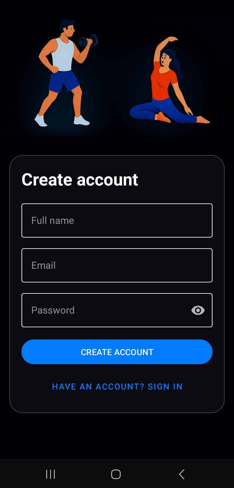
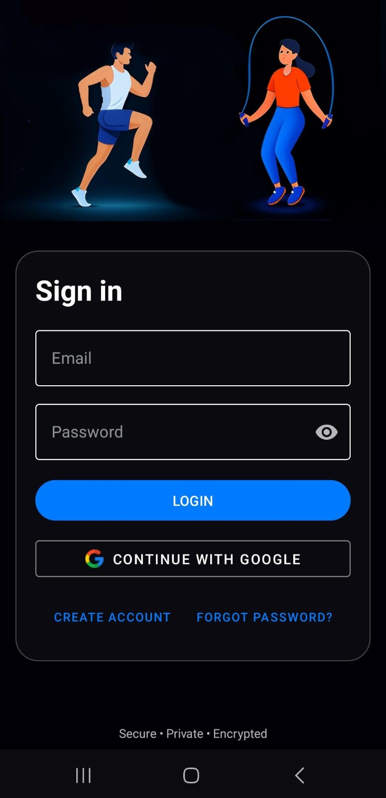

<div align="center">

<h1>📈📱 FitNexx Android Application ⚡💪</h1>

<h2>
  
</h2>

</div>

---

<div align="center">

[](https://www.adobe.com/products/photoshop.html)
[](https://developer.android.com/)
[](https://developer.android.com/studio)
[](https://firebase.google.com/)
[](https://git-scm.com/)
[](https://github.com/)
[](https://github.com/features/actions)
[](https://gradle.org/)
[](https://www.java.com/en/)
[](https://openjdk.org/)
[](https://kotlinlang.org/)
[](https://www.mongodb.com/)
[![REST API](https://img.shields.io/badge/REST%20API-5C5C5C?style=for-the-badge&logo=data:image/svg%2bxml;base64,PHN2ZyB4bWxucz0iaHR0cDovL3d3dy53My5vcmcvMjAwMC9zdmciIHZpZXdCb3g9IjAgMCA1MCA1MCI+PHBhdGggZD0iTTI1IDJDMTIuMzcgMiAyIDEyLjM3IDIgMjVzMTAuMzcgMjMgMjMgMjMgMjMtMTAuMzcgMjMtMjNTMzcuNjMgMiAyNSAyeiIvPjxwYXRoIGZpbGw9IiNGRkYiIGQ9Ik0zMS4xNyAyNC4yNWE0Ljc1IDQuNzUgMCAwIDAtLjE0Ljk5bC0xLjIxIDQuODRhMy41IDMuNSAwIDAgMS0zLjM1IDIuNThjLTEuMTggMC0yLjI3LS41LTItMS4zYTMuNSAzLjUgMCAwIDEtLjEtLjY4bC0uODQtMy4zNWExLjIgMS4yIDAgMCAwLS45NC0uNzljLS40MiAwLS43Ny4yNS0uOTQuNjhsLS44NCAzLjM1YTMuNSAzLjUgMCAwIDEtMi41OCAyLjA4Yy0uOTggMCAtMS45NS0uMy0yLjcyLS44bDEuMjEtNC44NGMwLS40LjItLjc3LjU0LTEuMDJsNC44NC0xLjIxYTEuMiAxLjIgMCAwIDAgLjctLjk0Yy0uMTctLjY4LS4yNS0xLjQ0LS4yNS0yLjI0IDAtLjguMS0xLjU1LjI1LTIuMjRjLS4xNy0uNjgtLjI1LTEuNDQtLjI1LTIuMjQgMC0uOC4xLTEuNTUuMjUtMi4yNEwyNS45NiAxOS4wM2E0Ljc1IDQuNzUgMCAwIDAgLjktLjY4bDEuMTQtNC42NGMzLjYxLTIuNjkgNi45OS02LjE0IDkuMjUtNi41NWEuMzUuMzUgMCAwIDEtLjMyLS4yNmMtMi4wMy40Ni01LjAyIDMuMDUtOC41NyA1Ljc2TDI0LjcgMTkuMTRhMS4wOCAxLjA4IDAgMCAwLS43My44M2MtLjI0Ljg2LS4zNyAxLjc2LS4zNyAyLjY3IDAgLjg1LjE2IDEuNjcuNDggMi40NWwtLjQ3IDEuODljLS40NC40NC0uNjggMS4wMi0uNjggMS42NHYyLjQ2YzAgLjYuMjUgMS4yLjY4IDEuNjQsLjQ0LjQ0IDEuMDMuNjggMS42NC42OGgyLjQ2Yy42MSAwIDEuMi0uMjUgMS42NC0uNjhMMjkgMjguMzZjLjI0LS44Ny4zNy0xLjc3LjM3LTIuNThhMS4wOCAxLjA4IDAgMCAwLS44My0uNzNMMy44MyAyMy40NUExLjIgMS4yIDAgMCAwIDMuMDggMjcuNjlsLjY3IDIuNjZjLjg5LjUgMS44NS45IDMuNS44YS44NC44NCAwIDAgMCAxLjM1LS40MWMuMDktLjMzLjE3LS42OC4yNS0xLjA0bC40Mi0yLjIyYTEuNTEgMS41MSAwIDAgMCAuNzktMS40NmMwLS40LS4yNS0uNzgtLjY4LTEuMDJsLTIuMDgtLjUyYTEuMzUgMS4zNSAwIDAgMS0xLS43MWMtLjI0LS45LS4zNi0xLjgxLS4zNi0yLjc2IDAtLjkuMTItMS43Ni4zNi0yLjYxbDcuMzktMy45NWMxLjQ5LS44IDIuNjMtMS45MyAzLjM5LTMuNDNsLjcyLTIuODdhMS45MyAxLjkzIDAgMCAwLS40Ni0yLjEzYzEuMTQgMS4yIDIuMiAyLjUgMy4xNSAzLjlMMjkuOTggMjEuOTlhNC45IDQuOSAwIDAgMC0uODMtMS43NWMtLjQ0LS41LS44NC0uOC0xLjI1LTEuMDZsLTIuNzMtLTIuMjVhMS4zNSAxLjM1IDAgMCAwLS41NC0xLjFsLTIuODQtMS43OWMwLS40LS4xNi0uNzctLjQ4LTEuMDNsLTIuODUtMi4wOGExLjYgMS42IDAgMCAwLTEtLjQ0bC0yLjgzLS41NWMtLjkyLS4xOC0xLjg2LS4yNy0yLjgyLS4yNy0xLjM2IDAtMi42Ny4zMy0zLjg0Ljk0bC01LjI4IDIuMDhjLS40LjE2LS43Ni4zMi0xLjA4LjU0TDMuNTggMjguNTZhLjg1Ljg1IDAgMCAwLS4wNi45NmMxLjA3LjggMi4xNiAxLjQgMy4zNiAxLjdMMTAuNyAyMi40YTEuMSAxLjEgMCAwIDAtLjQ4LTEuMTZjLS4zOC0uMzItLjYtLjc0LS42LTEuMjEgMC0uNDkuMjItLjkxLjYtMS4yMyAxLjM1LS45IDMuMS0xLjMgNS4wNy0xLjEgMi4wNy4xNyAzLjk5IDEuMTcgNS41OCAyLjk1TDIyLjE0IDI3LjhhMi4wNyAyLjA3IDAgMCAxLS43MyAxLjg1bC0yLjkyIDEuODdjLS44OC40My0xLjU1IDEuMi0xLjk0IDIuMTItLjM4LjkyLS41OCAxLjkxLS41OCAyLjk5IDAgLjczLjEgMS40LjI1IDIuMDZsLS45MiAzLjY3YTEuNSAxLjUgMCAwIDEtLjY5IDEuMjEgMi4xMSAyLjExIDAgMCAxLTEuMDguNDVsLTQuNi4zOWExLjcgMS43IDAgMCAwLS44NC41MmMtLjMxLjQxLS40OC45Mi0uNDggMS40NiAwIC41Ni4yIDEuMDguNTEgMS40N2w1LjQ3IDUuNDdhMS4xMSAxLjExIDAgMCAwIDEuNTYuMDdsNC43NS0zLjE2YzEuMjctLjg0IDIuMzMtMS45MyAzLjE3LTMuMTgsMS40LTIuMDYgMi4xMy00LjM2IDIuMTMtNi44NHYtMS42NmMwLS40LS4xNi0uNzYtLjQ5LTEuMDhsLTIuMjgtMS44OGExLjUgMS41IDAgMCAwLTEtLjUxYy0uMzIgMC0uNjEuMTQtLjg0LjM3bC0yLjkyIDIuNDhjLS45LjctMi4wNSAxLjEtMy4yMyAxLjFIMjQuNGEyLjMyIDIuMzIgMCAwIDEtMS41Ni0uNjhsLTEuMDQtMS4wNGMtLjI0LS4yNC0uNTgtLjM3LS45Mi0uMzdIMTguOWExLjMgMS4zIDAgMCAxLS42OC0uMThsLTEuODktMS4wN2MtLjM2LS4yLS42LS41Ni0uNi0uOTZzLjI1LS43Ni42LTEuMDZsMy41My0zLjEzYy40LS40LjY4LS45NS42OC0xLjU0djEuNzZabS41LTExLjc4YzEuNTggMCAyLjg2LTEuMjggMi44Ni0yLjg2czEuMjgtMi44NiAyLjg2LTIuODYtMi44NiAxLjI4LTIuODYgMi44NlMyNi4zMiAzNC4yIDI0Ljc0IDM0LjJzLTIuODYtMS4yOC0yLjg2LTIuODZjLTMuMDkgNC41LTguMzMgNS44Mi0xMy42MiA0LjI0LjY4LS45IDEuNzItMS41OSAzLjAyLTAuNTZMMjYuMSAyNC42YTIuODcgMi44NyAwIDAgMC0xLjM2LTQuNzVjLS42NS0uNjYtMS41Ny0uOTktMi40Ny0uOTktLjkgMC0xLjc1LjMzLTIuNDEuOTlsLTEuOTQgMS40MWMtLjMyLjIzLS42LjUyLS44Mi44NWEuODQuODQgMCAwIDEtLjE1LjlMMi43IDMyLjQxYy0uMjQuMTctLjQ5LjMtLjc1LjQyLTIuNTIuNzMtNC44NSAxLjQ3LTYuNjEgMi4yOC0uMjQuMS0uNC4yNC0uNDkuNDMtLjA5LjE5LS4xMy4zOS0uMTEuNGEyLjMgMi4zIDAgMCAwLS4wNS43MWMtLjI0Ljg2LS4zNyAxLjc2LS4zNyAyLjY3IDAgLjg2LjExIDEuNjkuMzMgMi40OWwtLjQgMS42YTEuOTcgMS45NyAwIDAgMC0uNDggMS42NyAyLjEgMi4xIDAgMCAwIDEuMDcuNDlsNC42LjM5YTEuMSAxLjEgMCAwIDAgLjY0LjM2bDEuODQuOTdjLjU1LjI4IDEuMTUuNTMgMS44LjcybDIuOTguMjljMS4wNC4wNyAyLjA0LjQ5IDIuNzkuMTRsMi41LS43YTEuMyAxLjMgMCAwIDAtLjc3LTEuMjVjMC0uNzUuNDItMS4zMyAxLjIxLTEuNjJsMi41OS0xLjQ2YTEuNiAxLjYgMCAwIDEtLjg0LS40OWwtMi44OC0yLjQ3YTEuMyAxLjMgMCAwIDAtLjc3LTEuMjVjMC0uNzUuNDItMS4zMyAxLjIxLTEuNjJsMi41OS0xLjQ2YTEuMyAxLjMgMCAwIDAtLjg2LS42MmwtMy44NC0xLjUxYTEuMyAxLjMgMCAwIDAtLjc3LTEuMjVjMC0uNzUuNDItMS4zMyAxLjIxLTEuNjJsMi41OS0xLjQ2YTEuMyAxLjMgMCAwIDAgLjU0LS42MmwtLjktMy42YTMuNTQgMy41NCAwIDAgMSAzLjMyLTIuMDhjMS4xOCAwIDIuMjcuNSAyIDEuM2EuODYuODYgMCAwIDEgLjEuNzhsLjA0LjE0YTMuMjkgMy4yOSAwIDAgMCAuNzkgMS43NWMuNDcuNCAxLjE1LjY4IDEuODUuNjhIMzhjMS4zNiAwIDIuNjctLjMzIDMuODQtLjk0bDIuNjUtMS4wOGMxLjQtLjU2IDIuNy0xLjI4IDMuOTMtMi4xNmwtLjU4LS4zNmMtLjQ2LS4zLTEuMDYtLjQ0LTEuNjgtLjQ0SDM3Yy0uODUgMC0xLjY5LjExLTIuNS40NWwtMi43MyAxLjI3YTEuMDkgMS4wOSAwIDAgMS0uNTQuM0MzMy41NiAzMy41IDMzLjIgMzMuOCAzMy4yIDM0LjJ6Ii8+PC9zdmc+)](https://en.wikipedia.org/wiki/Representational_state_transfer)
[](https://developer.android.com/topic/libraries/architecture/room)

</div>

---

**Module Name**: Programming 3D [PROG7314] <br>
**Assessment Type**: PoE: Part 2 - App Prototype Development <br>
**IIE Varsity College Westville** <br>

**GitHub Repository**: <br>
**FitNexx APK Repository**: <br>
**FitNexx Android API Repository**: <br>
**Video Demonstration (OneDrive)**: <br>

---

## 📑Table of Contents

✨ **1. Introduction** <br>
🎯 **2. Purpose** <br>
🎨 **3. Design Decisions** <br>
🤖 **4. GitHub Actions** <br>
💻 **5. Setting Up the Project Locally & Usage** <br>
✅ **6. Requirements and Features** <br>
⚙️ **7. Functionality** <br>
🖼️ **8. Image Assets** <br>
🏗️ **9. Architecture** <br>
👥 **10. Authors & Contributors** <br>
⚖️ **11. MIT License** <br>
❓ **12. Frequently Asked Questions (FAQ)** <br>
📚 **13. References** <br>

---

## ✨ 1. Introduction

The **FitNexx Android Application** is an innovative mobile application built using Kotlin and Android Studio. It is designed to empower users to achieve their fitness goals by providing personalized workout plans, real-time tracking, and innovative features in a seamless, user-friendly interface.

This application centers around core principles of fitness management — tracking daily activity, customizing routines, analyzing progress, and fostering consistent habits. In its current prototype, the app stores data locally using RoomDB, enabling core functionality like step counting and basic analytics without requiring constant internet access.

Integration with a custom REST API hosted on MongoDB for data persistence, along with Firebase for authentication, is implemented for secure user management. Future updates will introduce advanced features such as biometric authentication, offline synchronization with cloud sync, real-time push notifications, and multi-language support to enhance accessibility and user engagement.

---

## 🎯 2. Purpose

The purpose of the FitNexx Fitness App is to develop a comprehensive, engaging mobile platform that assists users in managing their fitness journeys effectively. The app aims to simplify the often overwhelming process of fitness tracking by enabling users to create custom workouts, monitor health metrics like steps and hydration, visualize progress through interactive charts, and receive motivational rewards. A key emphasis is on incorporating gamification and adaptive analytics to make fitness fun and sustainable, encouraging long-term adherence to healthy habits. The app is tailored to support users from beginners to advanced enthusiasts, with features like live movement tracking, context-based alerts, and exportable reports. By leveraging local storage for offline use and integrating with online databases for seamless data access, FitNexx promotes inclusivity, especially for users in regions with variable internet connectivity, such as South Africa. Ultimately, it empowers individuals to take control of their physical well-being through intelligent recommendations, progress insights, and a supportive ecosystem that adapts to their needs.

### Core Objectives:

- Enable users to register and log in securely using single sign-on (SSO) with Firebase Authentication for a streamlined and safe entry point.
- Support tracking of daily metrics such as steps, calorie burns, hydration levels, and activity logs, with options to input or auto-detect data.
- Facilitate goal setting for fitness milestones, including daily steps, workout completion, and hydration targets, with progress visualized in interactive charts.
- Provide a dynamic dashboard for real-time overviews of health metrics, highlighting achievements and areas for improvement.
- Display fitness trends through graphs for user-selectable periods.
- Incorporate gamification features like earning points and maintaining streaks for consistent goal achievement to boost motivation.
- Store data in an online database using MongoDB for persistence and Firebase for authentication, enabling secure access across devices.

---

## 🎨 3. Design Decisions

The design decisions for the app are informed by the research, planning, and implementation requirements. These decisions aim to ensure functionality, usability, and engagement while adhering to the technical and academic requirements.

### Key design decisions:

- **Intuitive and Engaging Layout**: The UI is crafted to be visually appealing and straightforward to navigate, drawing users in with a modern aesthetic that motivates regular use for workouts and tracking. Consistent layouts, such as bottom navigation bars, paired with clean DejaVu Sans fonts and a blue, white, and black cohesive color scheme, create a professional and unified experience. Adequate spacing between elements, like buttons and progress indicators, reduces clutter and enhances usability, making it easy for users to interact without frustration. The predominant use of blue tones evokes energy, trust, and calmness—ideal for a fitness app—as it symbolizes movement and progress, aligning with the app's theme of "Step Into The Next You" and encouraging a positive mindset during exercise sessions.
- **Error Handling**: The app is engineered for robustness, gracefully managing invalid inputs like incorrect login credentials or incomplete workout forms without crashing. Input validation is integrated throughout, such as checking for required fields in user registration or ensuring numerical entries for reps and steps are positive integers, with user-friendly error messages displayed via toasts or dialogs to guide corrections and maintain a smooth experience.
- **Gamification Elements**: Features like earning points and building streaks for consistent water intake or goal completion are designed to leverage psychological principles of reward and habit formation. This makes the app more interactive and addictive in a positive way, transforming routine tracking into an engaging game that motivates users to stay committed to their fitness routines over time.
- **Visual Feedback (Adaptive Analytics and Interactive Fitness Visuals)**: Analytics are presented through interactive bar graphs and charts that track metrics like steps, water intake, and calories burned. Users can filter by date range for detailed insights, simplifying complex data into actionable visuals. This design ensures quick comprehension of health status, helping users spot improvements or gaps without manual analysis.
- **Online Database**: User data is persisted in MongoDB for flexible storage of workouts, logs, and metrics, while Firebase handles authentication and authorization for secure SSO logins. This hybrid approach allows seamless access across devices, automatic backups, and scalability for future growth. Advantages include enhanced data security through encryption, real-time synchronization when online, and reliability in preventing data loss, providing a consistent experience whether users switch phones or recover accounts.
- **Smart Notifications and Context-Based Alerts**: Notifications are intelligent and personalized, factoring in user activity, and performance data. For instance, alerts might notify users of remaining calories to burn, suggest hydration, or remind them of steps needed to hit daily goals. This design avoids generic spam, delivering timely, relevant prompts that feel supportive rather than intrusive.

---

## 🤖 4. GitHub Actions

```
name: Android Build

on:
  push:
    branches: [ main ]
  pull_request:
    branches: [ main ]

jobs:
  build:
    runs-on: ubuntu-latest

    steps:
    - name: Checkout Repository
      uses: actions/checkout@v3

    - name: Set up JDK 17
      uses: actions/setup-java@v3
      with:
        distribution: 'temurin'
        java-version: '17'

    - name: Give gradlew permission
      run: chmod +x ./gradlew

    - name: Build Debug APK
      run: ./gradlew assembleDebug
```


---

## 💻 5. Setting Up the Project Locally & Usage

### Prerequisites:

- Android Studio IDE
- JDK 17+
- Kotlin 1.8+
- Gradle 8.0+
- Android device or emulator with Android 7.0 (API 24) or higher
- Internet connection (only required for future Firebase functionality)

### Installation Steps:

#### Method 1: Downloading the ZIP File from GitHub

1. **Download the ZIP**: Click the green "Code" button near the top-right of the page. In the dropdown menu, select "Download ZIP". This will download a compressed file (e.g., repo-name-main.zip) to your computer's Downloads folder. The file size depends on the repo but is usually quick to download.
2. **Extract the ZIP File**: Locate the downloaded ZIP file in your file explorer (e.g., File Explorer on Windows or Finder on macOS). Right-click the file and choose "Extract All" (Windows) or double-click to unzip (macOS). Extract it to a convenient location, such as your Documents or Desktop folder. This creates a new folder with the repo's contents (e.g., repo-name-main). Avoid extracting to a path with spaces or special characters, as this can cause build issues.
3. **Open the Project in Android Studio**: Launch Android Studio. If it's your first time or no project is open, you'll see the Welcome screen. Click "Open" (or "Open an existing project" in older versions). Navigate to the extracted folder and select it (make sure you select the root folder containing files like build.gradle and settings.gradle). Click "OK" to import the project. Android Studio will load the project structure in the Project view (usually on the left sidebar).
4. **Wait for Gradle Sync**: Once the project opens, Android Studio will automatically start syncing with Gradle files. This process downloads dependencies (like libraries specified in build.gradle) and configures the build environment. You'll see a progress bar at the bottom of the window saying "Gradle sync in progress" or similar. This can take 1-10 minutes depending on your internet speed and the project's complexity—be patient and don't close Android Studio. If it fails (e.g., due to network issues), click the "Sync Project with Gradle Files" icon (elephant symbol) in the toolbar to retry. Check the "Event Log" or "Build" tab at the bottom for error details, and resolve any issues like updating the Gradle version if prompted.
5. **Resolve Any Initial Issues**: After sync completes successfully (you'll see "Gradle sync finished" in the status bar), review the project. If there are errors (red underlines in code), fix them by following prompts, such as accepting SDK license agreements (via Tools > SDK Manager) or updating outdated dependencies in build.gradle files.

#### Method 2: Using GitHub Desktop for Cloning

1. **Clone the Repository**: In your browser, go to the GitHub repo page and click the green "Code" button. Copy the HTTPS URL (e.g., https://github.com/username/repo-name.git). Open GitHub Desktop, click "File" > "Clone repository" (or the "+" button in the top-left). In the dialog, paste the URL into the "URL" tab, choose a local path to save it (e.g., Documents/GitHub/repo-name), and click "Clone". This downloads the entire repo to your computer, including version history. The process might take a few minutes.
2. **Open the Cloned Project in Android Studio**: Once cloned, note the local folder path in GitHub Desktop (visible in the repository list). Launch Android Studio, click "Open" from the Welcome screen, and navigate to the cloned folder (select the root with build.gradle). Proceed as in Step 4 of Method 1.
3. **Wait for Gradle Sync**: Follow the same Gradle sync process as in Method 1, Step 5. If you make changes later, you can use GitHub Desktop to commit and push them.

#### Building and Running the App on Your Phone

After opening the project via either method and successful Gradle sync, you can build and install the app on a physical Android phone. This requires a USB cable and enabling developer options on your phone. (Alternatively, you could use an emulator via AVD Manager in Android Studio, but we'll focus on a physical device as requested.)

1. **Enable Developer Options on Your Phone**: On your Android phone, go to Settings > About phone. Tap "Build number" 7 times quickly until you see "You are now a developer!" Unlock your phone if needed.
2. **Enable USB Debugging**: Go back to Settings > System > Developer options (it appears after Step 1). Toggle "USB debugging" on. Confirm any prompts. Also, enable "Install via USB" if available (for some devices). Set "Default USB configuration" to "File Transfer" or "MTP" for better connectivity.
3. **Connect Your Phone to the Computer**: Use a USB cable to connect your phone to your computer. On your phone, allow USB debugging when prompted (check "Always allow from this computer" for future ease). Your computer might install drivers automatically; if not, download them from your phone manufacturer's site (e.g., Samsung or Google).
4. **Configure and Run the App in Android Studio**: In Android Studio, click the green "Run" button (play icon) in the toolbar, or go to Run > Run 'app'. In the "Select Deployment Target" dialog, your connected phone should appear (e.g., "Pixel 6 [serial number]"). Select it and click "OK". Android Studio will build the APK (this might take 1-5 minutes the first time, showing "Building" in the status bar), install it on your phone, and launch the app automatically.
5. **Handle Installation Prompts**: On your phone, you may see a prompt to install the app—tap "Install". If it warns about unknown sources, go to Settings > Apps > Special app access > Install unknown apps, and allow Android Studio or Chrome. After installation, the app should open. If it crashes, check the "Run" tab in Android Studio for logcat errors and debug accordingly.
6. **Test and Uninstall if Needed**: Use the app on your phone. To stop debugging, click the red "Stop" button in Android Studio. To uninstall, go to your phone's Settings > Apps, find the app, and tap "Uninstall".

(Optional) Place `google-services.json` in the app folder for future Firebase setup

### Usage

1. **Launch the App on Your Device**: Once the app is running on an emulator or your Android device via USB debugging, connect your phone to your computer, enable USB debugging in Developer Options, and select your device in Android Studio's "Run" configuration. The app will install and open automatically, displaying the welcome screen or login page.

2. **Register and Log In**: Tap the "Sign Up" button on the welcome screen to create a new account using single sign-on (SSO) with Firebase Authentication. Enter your email and follow the prompts to verify your account. To log in, tap "Log In," enter your credentials, and authenticate securely to access your personalized dashboard.

3. **Customize Your Settings**: Navigate to the "Profile" tab from the bottom navigation bar. Here, you can adjust preferences such as toggling dark/light mode, enabling/disabling notifications, selecting your preferred language (English, isiZulu, or Afrikaans), and setting privacy options to tailor the app to your needs.

4. **Create and Track Workouts**: Access the "Workout Builder" from the main menu. Select exercises, set reps, rest periods, and save your custom plan. During workouts, use the live step counter and movement tracking features to monitor your progress in real-time, with visual demos guiding your form.

5. **View Analytics and Visual Feedback**: Head to the "Analytics" tab to explore interactive charts and progress rings displaying steps, calories burned, and hydration levels. Tap on graphs to expand details, helping you identify trends and areas for improvement with adaptive, actionable insights.

6. **Earn Rewards with Gamification**: Engage with the app daily to earn XP, badges, and maintain streaks by meeting goals like workout completion or step targets. Check your rewards in the "Progress" section to stay motivated and track your fitness journey.

7. **Export Activity Logs**: From the "Reports" section, generate a PDF of your workout and health logs. Tap "Export" to save the file to your device, allowing you to share it with a coach or review your progress offline at your convenience.

8. **Receive Smart Notifications**: Stay informed with context-based alerts, such as hydration reminders during hot weather or step goal updates. Customize notification settings in the Profile tab to ensure timely and relevant prompts enhance your experience.

### Plugins

- **MPAndroidChart**: Utilized for rendering visual charts, such as the graph showing water intake and steps completed. This plugin enables the creation of clear, interactive visualizations to display trends.
- **Android-Iconics**: Employed to integrate Material Design icons into the app’s user interface. It enhances the visual appeal and consistency of the UI by providing scalable, customizable icons for elements like buttons, or menus, aligning with the requirement for an intuitive and engaging design.
- **PdfDocument**: Used for exporting data to PDF format. This plugin supports potential additional features (e.g., allowing users to save or share reports), enhancing the app’s functionality beyond the minimum requirements.
- **Firebase**: Used for online database storage and user authentication. It enables data synchronization across devices and secure login functionality, meeting the requirement for online data storage.
- **IconsDrawable**: The IconicsDrawable class is part of the Android-Iconics library, and it's used render vector-based icons from icon fonts (like FontAwesome), customize icon size, color, padding, and contours programmatically, avoid using .png images by replacing them with scalable font-based icons.

---

## ✅ 6. Requirements and Features

### Non-Functional Requirements:

- **Security**: Implemented through Firebase Authentication for SSO login and secure session management, with planned integration of biometric authentication (fingerprint or facial recognition) to protect user data. Data encryption is applied to sensitive information like health metrics and personal profiles stored in MongoDB, ensuring compliance with privacy standards and preventing unauthorized access.
- **Performance**: Optimized for smooth real-time tracking, such as live step counting via device sensors, with efficient database queries to MongoDB for fast data retrieval. The app handles offline operations using RoomDB for local caching, minimizing latency during syncs and ensuring responsive UI even under varying network conditions.
- **Scalability**: Designed with a REST API backend connected to MongoDB, allowing for easy expansion to handle increased user loads or additional features like cloud syncing. Future updates will leverage scalable cloud services to support growing data volumes from user analytics and notifications without degrading performance.
- **Compatibility**: Compatible with Android devices running version 7.0 (Nougat) and above, ensuring broad accessibility across a range of smartphones and tablets. The app adapts to different screen sizes and orientations using responsive layouts.
- **Maintainability**: Codebase is organized into modular components with clear separation of concerns (e.g., MVVM architecture), well-documented classes, and version control via Git. This facilitates easy updates, bug fixes, and collaboration among developers.
- **Usability**: Features an intuitive interface with clean navigation, visual feedback through interactive charts, and multi-language support for English, isiZulu, and Afrikaans. Accessibility considerations include high-contrast themes, voice-over compatibility, and simple workflows to enhance user engagement and reduce learning curves.

### Required Functionalities (PoE Part 2):

- **Mobile Device Compatibility**: The application is optimized to run seamlessly on Android mobile devices, leveraging native hardware features like motion sensors for accurate tracking and ensuring efficient battery usage during background operations.
- **User Registration and Login via SSO**: Users can securely register and log in using single sign-on (SSO) integration with providers like Firebase, streamlining authentication while maintaining data privacy and enabling quick access to personalized features.
- **Settings Customization**: Users have the ability to modify app settings, including preferences for notifications, language selection, theme modes, and privacy controls, allowing for a tailored experience that adapts to individual needs.
- **REST API Integration**: The app connects to a custom-built REST API that interfaces with a backend database (e.g., MongoDB), enabling secure data exchange for features like storing workout logs, syncing progress, and retrieving analytics.

### Non-Required Additional Features:

- **Adaptive Analytics and Interactive Fitness Visuals**: Collects user health metrics (e.g., steps, calories burned, hydration) and presents them via interactive charts, graphs, and progress rings, providing actionable insights to help users track trends and make informed adjustments to their fitness routines.
- **Live Step Counter**: Utilizes the device's built-in motion sensors to provide real-time step tracking, updating the dashboard instantly without requiring external wearables, and continues counting accurately even when the app runs in the background.
- **Movement Tracking**: Monitors physical activities through sensor data, offering detailed logs of movements like walking or running, with visualizations to show daily performance and integration with goals for comprehensive activity oversight.
- **Gamification System**: Incorporates reward-based mechanics such as earning points and maintaining streaks for completing workouts, meeting hydration targets, or achieving step milestones, fostering motivation and long-term user engagement through psychological incentives.
- **Exportable Activity Log Reports**: Allows users to generate and export detailed reports of workouts, health metrics, and progress in PDF format, facilitating sharing with trainers, personal analysis, or long-term tracking outside the app.

---

## ⚙️ 7. Functionality

- Register and log in via SSO with Firebase Authentication
- Create, edit, and save custom workouts with exercises, reps, rest times, and visual demos
- Track live steps, calorie burns, hydration, and other metrics using device sensors
- Set and monitor fitness goals with progress rings and streaks
- View interactive dashboards with bar graphs for daily/weekly analytics
- Earn badges, XP, and rewards through gamification for consistent achievements
- Generate and export activity logs as PDFs for sharing or analysis
- Customize app settings, including theme preferences and notification toggles
- Access multi-language support for English, isiZulu, and Afrikaans
- Store data locally with RoomDB and sync to MongoDB for online persistence
- Receive context-based push notifications for personalized alerts

---

## 🖼️ 8. Image Assets

| Image/Screenshot | Description |
| :--------------: | :---------- |
|  | Create Account screen |
|  | Sign In screen |
|  | Main Dashboard view |
|  | Water Intake tracker |
|  | User history page |
|  | Steps tracking screen |
|  | Distance tracking screen |
|  | Calories tracking screen |
|  | Workout session screen |
|  | Analytics view 1 |
|  | Analytics view 2 |
|  | Analytics view 3 |
|  | Analytics view 4 |
|  | Profile page 1 |
|  | Profile page 2 |
|  | Gamification features screen |
|  | System settings screen |
|  | User preferences page |
|  | About App page |


---

## 🏗️ 9. Architecture

FitNexx follows the MVVM (Model-View-ViewModel) architecture for a clean separation of concerns and scalability:

- **Model**: Contains Room entities, data classes, and DAOs
- **View**: Activities and fragments display data and capture user input
- **ViewModel**: Manages business logic and LiveData for the UI

---

## 👥 10. Authors & Contributors

- **Braden Caleb Perumal (ST10287165)**
- **Nikhile Reddy (ST10338305)**
- **Ishkar Singh (ST10395002)**
- **Abdul Basit Shahid Deshmukh (ST10316123)**

We are the sole authors of the FitNexx Android Application.
Please email dbw@varsitycollege.co.za or, alternatively StudentServicesWVL@varsitycollege.co.za for any inquiries or concerns.

### Reporting Issues:

- Any bugs, glitches can be reported using the GitHub repository, provided with detailed information about the issue, how it arises, any error message etc. - Screenshots if applicable
  Proposing Enhancements:
- Suggestions are welcome and may be proposed on the GitHub repository - open to discussion.
  Submitting Pull Requests:
- Submit a pull request (PR) on the GitHub repository.
- Fork the repository, create a new branch for your changes, and commit your modifications with clear and concise commit messages.
- Ensure that your code adheres to the project's coding standards and follows best practices.
- Provide a detailed description of your changes in the pull request, explaining the problem you're addressing and the solution you've implemented.

---

## ⚖️ 11. MIT License

Copyright (c) 2025 Android Application

Permission is hereby granted, free of charge, to any person obtaining a copy of this software and associated documentation files (the "Software"), to deal
in the Software without restriction, including without limitation the rights to use, copy, modify, merge, publish, distribute, sublicense, and/or sell copies of the Software, and to permit persons to whom the Software is furnished to do so, subject to the following conditions:

The above copyright notice and this permission notice shall be included in all copies or substantial portions of the Software.

THE SOFTWARE IS PROVIDED "AS IS", WITHOUT WARRANTY OF ANY KIND, EXPRESS OR IMPLIED, INCLUDING BUT NOT LIMITED TO THE WARRANTIES OF MERCHANTABILITY, FITNESS FOR A PARTICULAR PURPOSE AND NONINFRINGEMENT. IN NO EVENT SHALL THE AUTHORS OR COPYRIGHT HOLDERS BE LIABLE FOR ANY CLAIM, DAMAGES OR OTHER LIABILITY, WHETHER IN AN ACTION OF CONTRACT, TORT OR OTHERWISE, ARISING FROM, OUT OF OR IN CONNECTION WITH THE SOFTWARE OR THE USE OR OTHER DEALINGS IN THE SOFTWARE.

---

## ❓ 12. Frequently Asked Questions (FAQ)

### 1. What is FitNexx and what does it do?

FitNexx is an Android-based fitness app designed to help users achieve and maintain their fitness goals with personalized workout plans, real-time tracking, and motivational features. It offers tools like live step counting, adaptive analytics, and gamification to make fitness engaging and accessible, even offline.

### 2. Who can use FitNexx?

FitNexx is suitable for a wide range of users, from beginners starting their fitness journey to advanced enthusiasts. Its multi-language support (English, isiZulu, and Afrikaans) and offline capabilities make it especially useful for South African users with varying fitness levels and internet access.

### 3. How do I set up my account and log in?

You can register and log in using single sign-on (SSO) via Firebase Authentication. Simply follow the on-screen prompts to create an account with your email or a supported SSO provider, and log in securely for future sessions.

### 4. What devices is FitNexx compatible with?

FitNexx is designed for Android devices running version 7.0 (Nougat) and above, supporting a variety of smartphones and tablets with adaptive layouts for different screen sizes.

### 5. How does the live step counter work?

The live step counter uses your phone’s built-in motion sensors to track steps in real-time, displaying updates on the dashboard. It works even when the app is in the background, eliminating the need for additional wearables.

### 6. What are the gamification features, and how do they work?

FitNexx includes a gamification system where you can earn points and maintain streaks by completing workouts, meeting hydration goals, or hitting step milestones. These rewards motivate consistent use and engagement.

### 7. How can I export my fitness data?

You can generate and export workout and health logs in PDF format directly from the app. This allows you to track progress over time, analyze data, or share it with a coach or healthcare provider.

### 8. Are my data and privacy secure?

Yes, FitNexx uses Firebase Authentication for secure SSO login and encrypts sensitive data stored in MongoDB. Future updates will include biometric authentication (fingerprint or facial recognition) to enhance security.

### 9. What languages does FitNexx support?

Currently, FitNexx supports English, isiZulu, and Afrikaans, making it accessible to a broader South African audience. You can switch languages in the app settings.

### 10. How do I receive notifications, and can I customize them?

FitNexx sends smart, context-based notifications (e.g., hydration reminders) via a push notification system. You can customize notification preferences in the app settings to suit your needs.

### 11. What should I do if the app crashes or has issues?

If you encounter issues, ensure your Android Studio project is synced properly with Gradle, check for updates, and review the logcat in Android Studio for error details. Restart the app or reinstall it if needed, and consult the GitHub repository’s issues page for known bugs or support.

---

## 📚 13. References

- **BroCode, n.d. Android Development for Beginners.** [online] _[YouTube (@BroCodez)](https://www.youtube.com/@BroCodez)_ [Accessed 2 May 2025].
- **PhilJay, n.d. MPAndroidChart.** [online] _[MPAndroidChart (GitHub)](https://github.com/PhilJay/MPAndroidChart)_ [Accessed 2 May 2025].
- **JetBrains, n.d. Kotlin Language Documentation.** [online] _[KotlinLang.org](https://kotlinlang.org/docs/home.html)_ [Accessed 2 May 2025].
- **Android Developers, n.d. Room Persistence Library.** [online] _[Android Developers](https://developer.android.com/jetpack/androidx/releases/room)_ [Accessed 2 May 2025].
- **Android Developers, n.d. PdfDocument API.** [online] _[Android Developers](https://developer.android.com/reference/android/graphics/pdf/PdfDocument)_ [Accessed 2 May 2025].
- **Android Developers, n.d. ViewModel Overview.** [online] _[Android Developers](https://developer.android.com/topic/libraries/architecture/viewmodel)_ [Accessed 2 May 2025].
- **Stack Overflow, n.d. Stack Overflow: Developer Community.** [online] _[Stack Overflow](https://stackoverflow.com/)_ [Accessed 2 May 2025].
- **Kusnier, J. Liquid Bottom Navigation UI Design in Jetpack Compose.** [online] YouTube Video. Available at: _[https://youtu.be/nP42CBV5Rd0](https://youtu.be/nP42CBV5Rd0)_ [Accessed: 2 May 2025].


the rest api log not showing, and also tekl me where to put the image assets 

git add README.md
git commit -m "Added fully formatted README for FitNexx"
git push origin main

the rest api log not showing, and also tekl me where to put the image assets 
